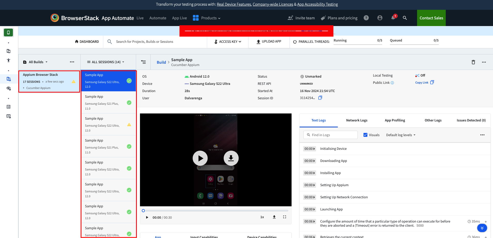

<h1 align="center">Automação Mobile com Appium</h1>
<p align="center">
  <a href="https://unform.dev">
    
  </a>
</p>
<p align="center">Appium é um projeto para facilitar a automação da interface do usuário de muitas plataformas de aplicativos, incluindo dispositivos móveis (iOS, Android, Tizen), navegadores (Chrome, Firefox, Safari), desktops (macOS, Windows), TVs (Roku, tvOS, Android TV, Samsung) e muito mais! 🚀</p>

## Tecnologias

<div align="center">

[](https://www.oracle.com/br/java/technologies/javase/jdk11-archive-downloads.html)<space><space>
[](https://cucumber.io/)<space><space>


</div>

## Sobre o projeto

Esse é um projeto básico de testes de E2E com Appium e Cucumber integrado a um pipeline de CI do GitHub Actions.
A arquitetura é baseada nos seguintes padrões e boas práticas:

- Page Object Model (POM): A separação dos elementos da página (Element Maps) e das ações da página (Page Classes) melhora a organização e manutenção do código.

- Cucumber com BDD: Os arquivos .feature descrevem cenários de teste em uma linguagem comum, facilitando a compreensão entre stakeholders. As Step Definitions implementam os passos dos cenários, conectando-os com as ações das páginas.

O projeto roda no BrowserStack, O BrowserStack é uma plataforma SasS que permite a execução de testes na nuvem em vários dispositivos reais.

## Estrutura do projeto
```
├── src
│   └── test
│       ├── java
│       │   ├── pages
│       │   ├── steps
│       │   │   └── Hooks -> Lifecycle dos testes 
│       │   ├── tests
│       │   └── utils
│       │       ├── BasePageAppium -> Classe abstrata que estende os métodos úteis e implementa as interfaces abaixo(DadosBS, Interacoes, JsonParser).
│       │       ├── DadosBS -> Interface com os metodos para log no BrowserStack
│       │       ├── Interacoes -> Interface com os metodos genericos para de interacao com elementos
│       │       ├── JsonParser -> Interface com um JSON parser para ler arquivos JSON
│       │       └── Utils -> Classe com os métodos úteis para instância dos drivers.   
│       └── resources
│           ├── apps -> Pasta com os apps
│           ├── features -> Pasta com as features
│           ├── devices.json -> Arquivo contendo a configuracao dos devices para teste
│           └── properties.json -> Arquivo contendo dados de login do BrowserStack e de tambem de build e projeto
└── README.md           
```


## Instalando dependências e rodando os testes.
Antes de rodar os testes é importante saber que existem dois tipos de execuções de testes, a execução single e a paralela.

#### Single
A execução single irá executar um arquivo feature após o outro, dessa maneira os nossos testes irão demorar mais para serem executados quando tivermos um grande volume de testes.

#### Paralela
A execução paralela irá executar mais de um arquivo feature por vez, dessa maneira os nossos testes irão executar de forma mais rápida em relação a execução single.
Isso acontece pois na execução paralela os testes são executados de forma simultânea.


<br>

Esse projeto pode ser configurado para rodar os testes em paralelo.
Caso você queira rodar os testes com execução parelela, precisará incluir o seguinte código:
```
<parallel>methods</parallel>
<useUnlimitedThreads>true</useUnlimitedThreads>

```


Obs.: Para rodar em paralelo no BrowserStack, será necessário possuir mais de uma licença.<br>
Exemplo: Caso você queria rodar 5 testes em paralelo, você precisará adquirir 5 licenças do App Automate.


## Ver testes no BrowserStack

Quando os testes forem iniciado, uma build sera criado no BrowserStack com uma sessao para cada teste que eh executado.


## Como alterar os devices de teste?

No arquivo "**devices.json**" eh possivel alterar os devices onde os testes serao executados.
Para isso eh preciso selecionar o device que voce deseja montar as capabilities dele.
Voce pode montar as capabilities nesse <a href="https://www.browserstack.com/app-automate/capabilities?tag=w3c">link</a>

Voce precisara das seguintes capabilities:
- "os": "nome do sistema operacional escolhido na configuracao"
- "device": "nome do device escolhido"
- "os_version": "versao do sistema operacional escolhido"
- "app_url": "url do app que voce subiu para o BrowserStack"


